<!-- Generated by scripts/build.py from scripts/content.py. Edit those, not this file. -->

<<<<<<< HEAD

=======

>>>>>>> 855b552de7838c7d2d7af2ca543c397d3aabad77

  

<picture><source media="(prefers-color-scheme: dark)" srcset="./assets/header-whoami-dark.svg"></picture>

<picture><source media="(prefers-color-scheme: dark)" srcset="./assets/batflower-dark.svg"></picture> <picture><source media="(prefers-color-scheme: dark)" srcset="./assets/whoami-dark.svg"></picture>

  

<picture><source media="(prefers-color-scheme: dark)" srcset="./assets/header-work-dark.svg"></picture>

<a href="https://pen-ai-omega.vercel.app"><picture><source media="(prefers-color-scheme: dark)" srcset="./assets/project-pentestai-dark.svg"></picture></a> <a href="https://harshithpramod.vercel.app/work/adforge"><picture><source media="(prefers-color-scheme: dark)" srcset="./assets/project-adforge-dark.svg"></picture></a>

<a href="https://smart-pantry-management.vercel.app"><picture><source media="(prefers-color-scheme: dark)" srcset="./assets/project-smartpantry-dark.svg"></picture></a>

Source: <a href="https://github.com/Harshithpramod/Pen-AI">PentestAI</a> · <a href="https://github.com/Harshithpramod/smart_pantry">Smart Pantry</a> · <a href="https://harshithpramod.vercel.app/work/adforge">AdForge case study</a>

  

<picture><source media="(prefers-color-scheme: dark)" srcset="./assets/header-principles-dark.svg"></picture>

<picture><source media="(prefers-color-scheme: dark)" srcset="./assets/principles-dark.svg"></picture>

  

<picture><source media="(prefers-color-scheme: dark)" srcset="./assets/header-activity-dark.svg"></picture>

<picture><source media="(prefers-color-scheme: dark)" srcset="https://raw.githubusercontent.com/Harshithpramod/Harshithpramod/output/snake-dark.svg"></picture>

  

<picture><source media="(prefers-color-scheme: dark)" srcset="./assets/header-contact-dark.svg"></picture>

<a href="https://harshithpramod.vercel.app"><picture><source media="(prefers-color-scheme: dark)" srcset="./assets/link-portfolio-dark.svg"></picture></a> <a href="https://www.linkedin.com/in/harshith-pramod-m/"><picture><source media="(prefers-color-scheme: dark)" srcset="./assets/link-linkedin-dark.svg"></picture></a> <a href="mailto:harshithpramodm@gmail.com"><picture><source media="(prefers-color-scheme: dark)" srcset="./assets/link-email-dark.svg"></picture></a> <a href="https://harshithpramod.vercel.app/Harshith_Pramod_Resume.pdf"><picture><source media="(prefers-color-scheme: dark)" srcset="./assets/link-resume-dark.svg"></picture></a>

